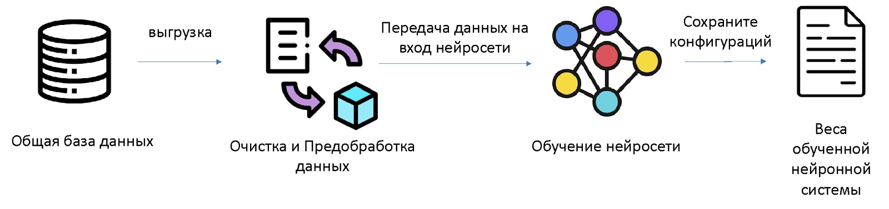
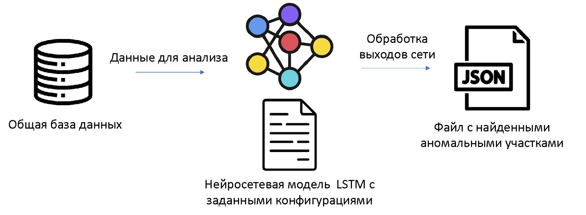
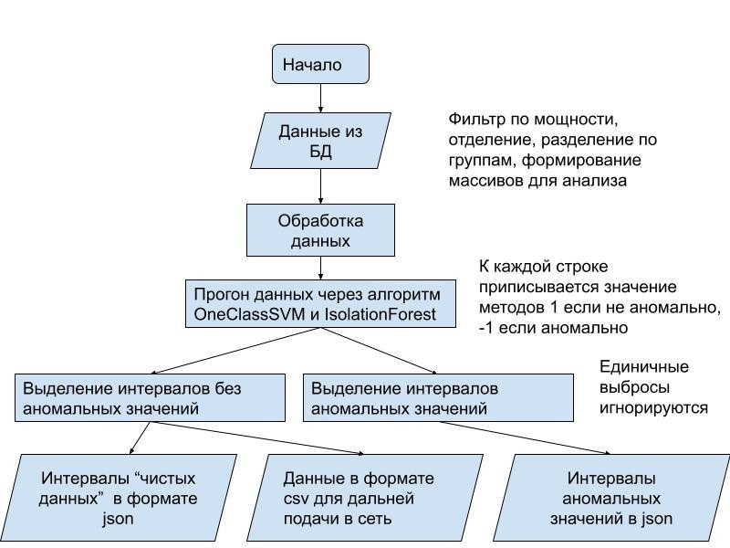

# Введение

Проект LSTM (Long Short-Term Memory) состоит из трех репозиториев, которые предоставляют инструменты для анализа данных с использованием нейронных сетей с долгой краткосрочной памятью (LSTM).

Репозиторий LSTM Train содержит утилиты для тренировки нейросети с использованием предварительно очищенных данных, в которых отсутствуют аномалии. В процессе обучения модели сохраняются наилучшие веса, которые затем используются для дальнейшего анализа.

В других репозиториях представлены онлайн (Online) и офлайн (Offline) режимы работы модели.

Офлайн режим позволяет анализировать заранее собранные данные и находить в них аномальные значения. При помощи обученной модели LSTM и сохраненных весов можно прогнозировать наличие аномалий в предоставленных данных.

Онлайн режим позволяет предсказывать вероятность возникновения аномалий в реальном времени. Датчиковые данные, поступающие в режиме онлайн, передаются в модель LSTM для вычисления вероятности аномалии.

[Демо](https://colab.research.google.com/drive/1cD-kjoClTZ8k8hB3UcgpgUdZW3V52k8j)

# Метод LSTM

Принцип метода состоит в том, чтобы найти закономерности в данных, а также определить стабильное состояние системы. В случае возникновения аномальной ситуации метод реагирует резким всплеском ошибки восстановления.

На первом этапе сеть обучается на отобранных заранее нормальных данных (данных без аномальных значений). В результате обучения сети мы имеем веса (сохраненные коэффициенты конфигурации нейронной сети).  Обученная модель может использоваться как для поиска аномалий уже в известных данных, так и для предсказания аварийных ситуаций в режиме реального времени.

Для поиска аномалий в известных данных через обученную модель проходят все данные (нормальные и возможно содержащие аномалии).

По полученным выходам нейронной сети в виде значений функции восстановления происходит анализ аномальности значений данных. Далее происходит поиск аномальных участков, сведения об этих участках собираются в отдельный файл, для генерации отчетов и отрисовки графиков.

[Подробное описание и эксперименты](https://docs.google.com/document/d/1QgrIO1EMjNjh5qNsPBrpf2tzKpCXebe9VpAg_k1nlj4/edit)

## **Очистка данных перед подачей в сеть**

На входе скрипта данные из бД (в csv или sql).На выходе скрипта очистки будет JSON где будут интервалы которые не аномальные (по мнению методов OneClassSVM и IsolationForest). Полученные данные используются для дальнейшего обучения сети.

Функция get_interval помогает выделять интервалы, работает как для выделения аномальных интервалов так и для выделения “чистых” . Интервал не прерывается если в нем выбросов подряд не более значение параметра DISCOUNT_BETWEEN_IDX. Этот параметр служит защитой, от единичных выбросов, которые могут прервать интервал. Минимальная длина интервала,  передается в функцию параметром len interval.

[Подробное описание и эксперименты](https://docs.google.com/document/d/1PIvx-qleaKjN-ZHAI-tg8Fn6Da0SRuCrtFcpG9biFts/edit?usp=sharing)

## Состав репозиториев

Проект LSTM состоит из следующих репозиториев:

1. **LSTM Train** - содержит утилиты для тренировки нейросети LSTM с использованием предварительно очищенных данных без аномалий. Обученная модель сохраняет наиболее удачные веса, которые будут использоваться для дальнейшего анализа.
2. **LSTM Online** - предоставляет возможность использовать обученную модель LSTM для онлайн-анализа данных. Датчиковые данные, полученные в режиме реального времени, подаются в модель, которая вычисляет вероятность возникновения аномалий.
3. **LSTM Offline** - позволяет проводить анализ заранее собранных данных с использованием обученной модели LSTM. Входные данные прогоняются через модель, и идентифицируются аномальные значения.
